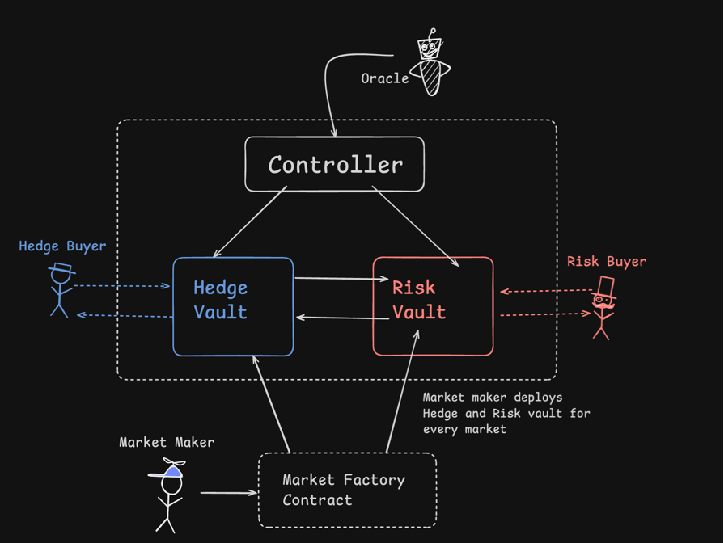

# Flight Delay Insurance Protocol

A decentralized insurance protocol where travelers pay 50 USDC for flight delay coverage (200 USDC payout) and investors provide capital through ERC4626 vaults to earn premiums and coverage amounts from non-claimed policies.

## Architecture 



## 🚀 Features

- **Fixed-price insurance**: 50 USDC premium, 200 USDC payout
- **Flight delay threshold**: 6+ hours triggers payout
- **ERC4626 risk vault**: For investor capital
- **Per-flight hedge vaults**: For insurance policy backing
- **4:1 capital ratio requirement**: 200 USDC backing per 50 USDC insurance
- **Oracle-based automatic claim settlement**: Using Acurast
- **24-hour policy expiration**: After flight time
- **Cross-chain vault operations**: Via LayerZero

## 🏗️ Architecture

### Tech Stack
- **Frontend**: Next.js 14, TypeScript, Tailwind CSS, shadcn/ui
- **Smart Contracts**: Solidity, Foundry
- **Wallet Integration**: Dynamic
- **Cross-Chain**: LayerZero
- **Oracle**: Acurast

### Smart Contracts
- `FlightInsurance.sol`: Main insurance controller
- `RiskVault.sol`: ERC4626 vault for capital providers
- `HedgeVault.sol`: Per-flight vault for policy backing

## 📦 Installation

### Prerequisites
- Node.js 18+
- Foundry
- Git

### Setup

1. **Clone the repository**
   ```bash
   git clone <repository-url>
   cd cursor_insurance
   ```

2. **Install dependencies**
   ```bash
   npm install
   ```

3. **Install Foundry dependencies**
   ```bash
   forge install OpenZeppelin/openzeppelin-contracts
   ```

4. **Set up environment variables**
   ```bash
   cp env.example .env
   # Edit .env with your configuration
   ```

5. **Compile contracts**
   ```bash
   forge build
   ```

6. **Run tests**
   ```bash
   forge test
   ```

7. **Start development server**
   ```bash
   npm run dev
   ```

## 🧪 Testing

### Smart Contract Tests
```bash
# Run all tests
forge test

# Run with verbose output
forge test -vvv

# Run specific test
forge test --match-test testCreatePolicy
```

### Frontend Tests
```bash
# Run linting
npm run lint

# Type checking
npm run type-check
```

## 🚀 Deployment

### Local Development
```bash
# Start local node
anvil

# Deploy contracts
forge script script/Deploy.s.sol --rpc-url http://localhost:8545 --broadcast
```

### Testnet Deployment
```bash
# Deploy to Base testnet
forge script script/Deploy.s.sol --rpc-url $BASE_TESTNET_RPC --broadcast --verify

# Deploy to Arbitrum testnet
forge script script/Deploy.s.sol --rpc-url $ARBITRUM_TESTNET_RPC --broadcast --verify
```

## 📁 Project Structure

```
cursor_insurance/
├── src/                    # Frontend source code
│   ├── app/               # Next.js App Router
│   ├── components/        # React components
│   ├── lib/              # Utility functions
│   ├── hooks/            # Custom React hooks
│   └── types/            # TypeScript definitions
├── contracts/            # Smart contracts
│   ├── interfaces/       # Contract interfaces
│   ├── core/            # Main contracts
│   ├── libraries/       # Contract libraries
│   └── mocks/           # Mock contracts for testing
├── scripts/             # Deployment scripts
├── test/                # Smart contract tests
├── docs/                # Documentation
└── public/              # Static assets
```

## 🔧 Configuration

### Environment Variables
- `NEXT_PUBLIC_BASE_RPC_URL`: Base network RPC URL
- `NEXT_PUBLIC_ARBITRUM_RPC_URL`: Arbitrum network RPC URL
- `NEXT_PUBLIC_DYNAMIC_ENVIRONMENT_ID`: Dynamic wallet environment ID
- `NEXT_PUBLIC_ACURAST_ENDPOINT`: Acurast oracle endpoint
- `ETHERSCAN_API_KEY`: Etherscan API key for verification
- `ARBISCAN_API_KEY`: Arbiscan API key for verification

### Network Configuration
- **Base Testnet**: Chain ID 84531
- **Arbitrum Testnet**: Chain ID 421613
- **Base Mainnet**: Chain ID 8453
- **Arbitrum Mainnet**: Chain ID 42161

## 📚 Documentation

- [Implementation Plan](./docs/Implementation.md)
- [Project Structure](./docs/project_structure.md)
- [UI/UX Documentation](./docs/UI_UX_doc.md)
- [Bug Tracking](./docs/Bug_tracking.md)

## 🤝 Contributing

1. Fork the repository
2. Create a feature branch (`git checkout -b feature/amazing-feature`)
3. Commit your changes (`git commit -m 'Add some amazing feature'`)
4. Push to the branch (`git push origin feature/amazing-feature`)
5. Open a Pull Request

## 📄 License

This project is licensed under the MIT License - see the [LICENSE](LICENSE) file for details.

## 🆘 Support

For support and questions:
- Create an issue in the GitHub repository
- Check the documentation in the `/docs` folder
- Review the implementation plan for current status

## 🔒 Security

This project is in development. Please do not use with real funds until security audits are completed.

## 📈 Roadmap

### Phase 1: Core Smart Contracts
- [x] Project setup and documentation
- [ ] FlightInsurance controller contract
- [ ] RiskVault (ERC4626) contract
- [ ] HedgeVault contract
- [ ] Basic insurance purchase and investor deposit flows
- [ ] Oracle integration for flight status

### Phase 2: Multi-Chain Expansion
- [ ] LayerZero integration
- [ ] Cross-chain vault operations
- [ ] Deploy to multiple testnets

### Phase 3: Frontend Development
- [ ] Dashboard for policy management
- [ ] Investment tracking interface
- [ ] Flight status monitoring
- [ ] Complete user experience

### Phase 4: Production Ready
- [ ] Security audits
- [ ] Mainnet deployment
- [ ] User onboarding materials
- [ ] Community engagement 